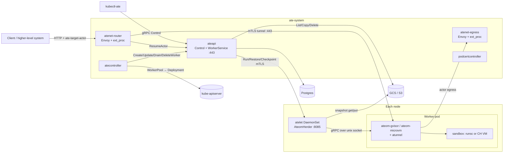
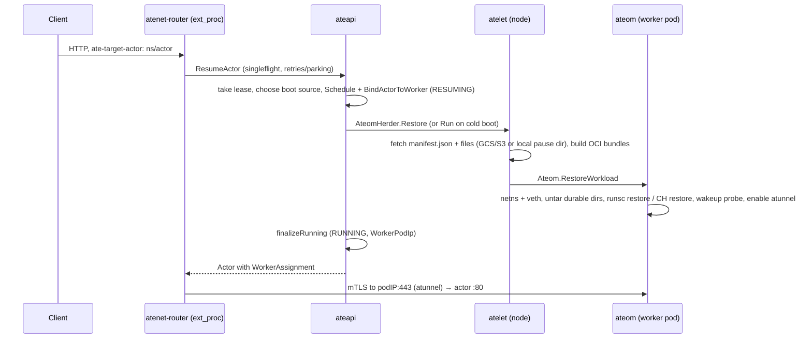

# Architecture

*Derived from code at `985c2002` (2026-09-23). File references are relative to the repo root.*

## Components

| Component | Binary | Role |
|---|---|---|
| Control plane | `cmd/ateapi` | Actor/template/worker API, scheduling, lifecycle workflows, golden-snapshot reconciler |
| Controller | `cmd/atecontroller` | WorkerPool → Deployment + NetworkPolicy; `workersync` mirrors worker pods into ateapi Worker records |
| Node supervisor | `cmd/atelet` | Image cache, OCI bundles, snapshot transfer, KVM device plugin, `AteomSupport` socket for ateoms |
| In-pod herder | `cmd/ateom-gvisor`, `cmd/ateom-microvm` | Drives `runsc` or cloud-hypervisor; sets up the actor netns; hosts `atunnel` |
| Networking | `cmd/atenet` | `router --mode=ingress\|egress`: an ext_proc beside an Envoy sidecar, with an embedded xDS server; `sdsmint` for egress MITM |
| Identity | `cmd/podcertcontroller` | Signs PodCertificate requests (SPIFFE pod identities); these certificates are the mTLS basis between components |
| Installer / CLI | `cmd/ate-setup`, `cmd/kubectl-ate` | Install (`hack/install-ate.sh` is a shim over ate-setup); user CLI |

**agentgateway variant.** The `components/agentgateway` kustomize component
*replaces* the atenet and Envoy containers with agentgateway, which then calls
ateapi itself. It runs as a non-blocking CI lane.

## Key abstractions and where they live

- **APIs**: `pkg/proto/ateapipb/ateapi.proto` is public, with services
  `Control` and `WorkerService` (the latter called by atelet). The node APIs
  are internal: `internal/proto/ateletpb` holds `AteomHerder`
  (ateapi → atelet) and `AteomSupport` (ateom → atelet), and
  `internal/proto/ateompb` holds `Ateom` (atelet → ateom).
- **CRDs**: WorkerPool, SandboxConfig and CSIDriverConfig in
  `pkg/api/v1alpha1`. The generated client is in `pkg/client`.
- **Store**: `store.Interface` (`cmd/ateapi/internal/store/store.go`). The
  only implementation is Postgres (`store/atepg`), which stores each object
  as a proto bytea plus `uid` and `version`. Goose migrations are in
  `atepg/migrations/`. Worker changes reach watchers through a transactional
  outbox (`atepg/outbox.go`).
- **Workflows**: `controlapi/workflow_*.go`. Each is a sequence of idempotent
  `ensure*` steps run under a per-actor Postgres lease
  (`lease:actor:<atespace>:<name>`).
- **Scheduling**: `cmd/ateapi/internal/scheduling` filters `workercache` with
  `Applies` (class, state, selectors, nodes) and `HasRoom` (resources and
  actor count), then picks at random. `BindActorToWorker` re-checks under
  `SELECT … FOR UPDATE`.
- **On-node layout**: `internal/ateompath` is the path contract that atelet
  and both ateoms share under `/var/lib/ateom-gvisor`.

## Actor lifecycle

States are the `ActorState` enum in `ateapi.proto`. There is no central
transition table; each workflow step checks its own edge.

```mermaid
stateDiagram-v2
  [*] --> SUSPENDED: CreateActor
  SUSPENDED --> RESUMING: ResumeActor
  PAUSED --> RESUMING: ResumeActor (prefers the same node)
  RESUMING --> RUNNING
  RUNNING --> PAUSING: PauseActor
  PAUSING --> PAUSED
  RUNNING --> SUSPENDING: SuspendActor
  PAUSED --> SUSPENDING: SuspendActor (upload local snapshot)
  SUSPENDING --> SUSPENDED
  RESUMING --> CRASHED: atelet error
  CRASHED --> REVERTING: RevertActor (also from RUNNING/PAUSED)
  REVERTING --> SUSPENDED
  SUSPENDED --> DELETING: DeleteActor (also CRASHED; any state with the override)
```

## Resume, end to end

- **Boot source** is chosen by `loadActorForResume` in `workflow_resume.go`,
  in this order: local (paused) snapshot, durable snapshot, golden snapshot,
  then cold boot.
- **Golden snapshots** are made by `template_reconciler.go`. It creates a
  throwaway actor in the golden atespace, resumes it, waits for warmup,
  suspends it with `Full` scope, then copies the snapshot to a tag.
- **Suspend** calls `Checkpoint(EXTERNAL)`, or `UploadPausedCheckpoint` for a
  paused actor. atelet uploads each file as `<uri>/<file>.zstd` and uploads
  `manifest.json` **last**, as the commit marker.
- **Pause** calls `Checkpoint(LOCAL)`. The files stay under
  `actors/<uid>/local-checkpoint/` on the node.

## Sandboxes

| | gVisor (`ateom-gvisor`) | micro-VM (`ateom-microvm`) |
|---|---|---|
| Runtime | `runsc` CLI | Kata agent (ttrpc over vsock) in a cloud-hypervisor VM |
| Full snapshot | `runsc checkpoint` + `durable-dir.tar` | CH snapshot + `rootfs-upper.tar` + `durable-dir.tar` |
| Data snapshot | `runsc pause`, tar the durable dirs, `resume` | tar from the host-side virtio-fs share |
| DurableDir volumes | 1 | many (subdirectories of one virtio-fs share) |
| Restore from Data onto the golden snapshot | no | yes (`onResume.fromData: Golden`) |

- **Sandbox binaries** come from the `SandboxConfig` named by the template.
  atelet fetches them and pins them in the snapshot manifest.
- **KVM access** for micro-VM pods comes from atelet's device plugin, which
  advertises `ate.dev/kvm`.

## Trust and identity

- **Component mTLS** uses SPIFFE certificates from podcertcontroller. ateapi
  accepts mTLS or a Bearer JWT (`internal/ateapiauth`), and pins atelet
  connections to the atelet pod's SPIFFE ID and UID.
- **atelet → ateom** is a node-local unix socket using *insecure* gRPC.
- **Actors** get JWTs (`MintActorJWT`) and egress certificates. Egress
  credential injection resolves `ate-secret://` URIs through
  `cmd/credential-provider`.
- **Authorization is not enforced yet** (see `questions.md`).
