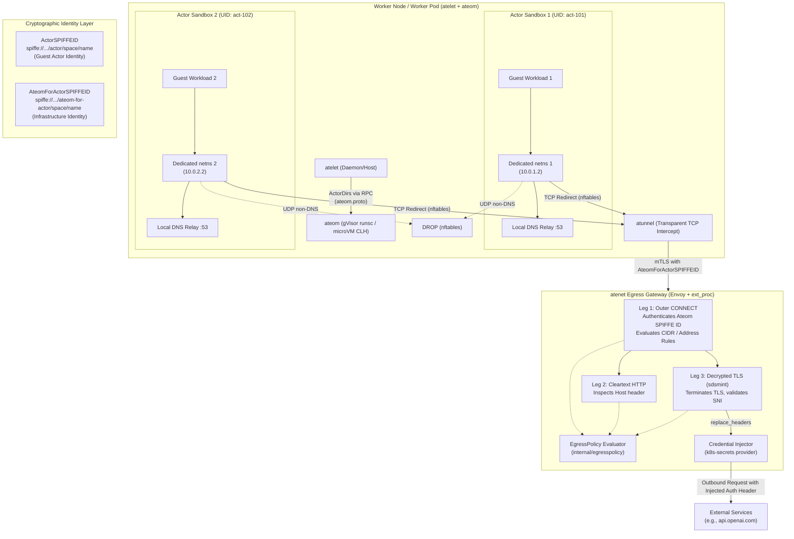

# Substrate Changes and Evolution (September 13 – September 28, 2026)

This document records the major changes, architectural shifts, churn distribution, breaking interface modifications, and open follow-up tasks in the [Substrate](https://github.com/agent-substrate/substrate) repository over the two-week window from September 13, 2026 to September 28, 2026. It serves as a self-contained catch-up briefing covering what was investigated, what landed in git history, and what remains actively unresolved.

---

## 1. Scope, Methodology, and Release Milestones

* **Window Covered:** September 13, 2026 22:35 UTC through September 28, 2026 18:30 UTC.
* **Commit Range:** `67253354..c7dbe9d6` (142 non-merge commits on `main` following commit `67253354`).
* **Branch State:** Local `main` fast-forwarded to `origin/main` via `git merge --ff-only origin/main`.
* **Tag & Release Branch:** Release tag `v0.2.0` was cut on commit `10a1bfb2` (September 25, 2026), creating branch `release-0.2`.
* **Investigation Note:** The GitHub CLI (`gh`) was unauthenticated in this environment (`gh auth status` returned exit code 1); all analysis, pull request references, issue connections, and architectural diffs were traced directly from git history, commit metadata, code diffs, and in-repo test fixtures.

---

## 2. Core Themes

### A. Multi-Actor Worker Concurrency and Per-Sandbox Networking
Substrate previously operated on a 1:1 worker-to-actor allocation model: a worker pod ran a single actor sandbox at any given time. During this two-week window, Substrate landed multi-actor concurrency on worker nodes. A single worker pod (running `atelet` and `ateom`) now concurrently hosts multiple independent actor sandboxes. This required dedicated per-sandbox Linux network namespaces, per-actor veth interfaces, local loopback and DNS relays, per-actor cgroup slices keyed by actor UID, and a separation of directory structures passed over RPC via `ActorDirs`.

### B. Egress Security, Credential Brokering, and Dataplane Hardening
Outbound traffic from actor sandboxes transitioned from an uninspected bypass to a strictly evaluated multi-leg pipeline governed by `EgressPolicy`. Prior to GA, `EgressRule` was redesigned as a union of protocols (`http`, `https`, and `tls_passthrough`), replacing legacy `hostnames`/`cidrs`/`all` rules. The data plane (`atenet` Envoy proxy + external processing) now intercepts traffic across outer mTLS CONNECT tunnels, cleartext HTTP, and decrypted TLS MITM legs (via `sdsmint`). Matching rules can inject or replace platform-brokered credentials (such as API keys stored in Kubernetes Secrets) without ever revealing the secrets to guest code. Unintercepted UDP egress was blocked for all destination ports except 53, closing covert QUIC/HTTP-3 bypasses. An experimental Envoy dynamic module written in Rust was introduced for in-process policy evaluation.

### C. Resilient Lifecycle Recovery (`RevertActor`) and Crash Semantics
Previously, an actor transitioning to the `CRASHED` state was in a terminal state that could only be deleted. This window introduced the `RevertActor` lifecycle RPC, allowing actors in `RUNNING`, `PAUSED`, or `CRASHED` states to safely discard corrupted execution state, cancel partial in-progress snapshots, and roll back to `SUSPENDED` at their last valid external snapshot. Concurrently, the legacy `ateerrors` taxonomy was deleted in favor of explicit fail-fast crash semantics, logging failure causes directly onto `ActorStatus`.

### D. Embedded Authorization (OpenFGA) and Relational Storage Refactoring
Fine-grained authorization was unified with the core API server. OpenFGA was embedded directly inside `ateapi`, sharing its PostgreSQL connection pool (`pgxpool.Pool`) and participating in database transactions (`pgx.Tx`). OpenFGA tables are now managed through standard Goose migrations alongside Substrate schemas (`000002_openfga.sql`). Simultaneously, the massive `atepg.go` storage file was decomposed into modular, per-resource stores.

### E. Developer Operations, Tooling, and Observability
More than 1,600 lines of brittle shell scripts in `hack/` were pruned or converted to shims delegating to `ate-setup`, a compiled Go CLI providing reproducible cluster installations, overlay management, and multi-architecture (arm64/amd64) builds. In observability, actor state transitions and usage metrics were wired to OpenTelemetry (OTel) logs with dual-write guarantees to pod stdout and OTLP collectors. The benchmarking harness gained `sweperf`, a trajectory-based workload based on realistic SWE-bench tasks.

---

## 3. Structural Architecture

The following diagram illustrates the updated runtime isolation model: multi-actor worker nodes with per-sandbox networking, split SPIFFE identities, and 3-leg egress inspection.

---

## 4. Notable Changes

### 1. Multi-Actor Worker Support & Per-Sandbox Networking
* **Commits:** `14c0c136` (PR #1836), `cd102f0a` (PR #1689), `a0b680d7` (PR #1730), `22efea18` (PR #1897), `7999d6f1` (PR #1885)
* **Details:**
  - Workers support concurrent actor sandboxes. In `internal/ateomnet/sandbox.go:29`, each actor is allocated an isolated network namespace with a unique veth pair and loopback interface.
  - In PR #1897, network namespace handling and DNS forwarders were split cleanly into `internal/ateomnet/netns` (`netns.go`, `dial.go`, `sysctl.go`) and `internal/ateomnet/dns` (`serve.go`, `resolvconf.go`).
  - In PR #1885, `atelet` telemetry pinned the multi-actor sweep fold, resolving three CPU-accounting defects (undercount on pending sweeps, overcount during sweep-spanning restores, and guest-agent decrease baseline handling).
  - `ActorDirs` (`internal/proto/ateompb/ateom.proto:113-128`) decouples directory derivation between `atelet` and `ateom`, splitting paths into `cmd/atelet/internal/ateletpath` and `internal/nodepath`.

### 2. Cryptographic Split Between Actor and Ateom Identities
* **Commits:** `8ea4abe1` (PR #1626), `8d6be5fb` (PR #1809), `7f7a40c1` (PR #1810), `ed6d2a1f` (PR #1923)
* **Details:**
  - `internal/resources/spiffe.go:27-108` defines two distinct SPIFFE IDs:
    - `ActorSPIFFEID`: `spiffe://substrate-actor.local/actor/<atespace>/<name>`
    - `AteomForActorSPIFFEID`: `spiffe://substrate-actor.local/ateom-for-actor/<atespace>/<name>`
  - `pkg/proto/ateapipb/ateapi.proto:2051` introduces `rpc MintAteomActorCertificate`.
  - In `cmd/ateapi/internal/authz/model.fga:87-95`, OpenFGA enforces **Node Restriction**: only the specific Kubernetes node hosting the scheduled worker pod (`can_mint_ateom_actor_credential: host_node`) may mint ateom credentials. System tunnels like `atunnel` use this certificate to communicate with `atenet` on behalf of the actor, preventing guest code from impersonating control plane infrastructure.

### 3. GA EgressPolicy Redesign and Credential Injection
* **Commits:** `6621f2b4` (PR #1751), `85ce8ed5` (PR #1360), `57234a86` (PR #1335), `30e6d33d` (PR #1535), `514e6109` (PR #1659), `d7d70420` (PR #1813), `58624ee8`
* **Details:**
  - **Breaking GA Overhaul (PR #1751):** `EgressRule` was refactored into a union of protocols (`http`, `https`, and `tls_passthrough`). The legacy `hostnames`, `cidrs`, and `all` rule categories were removed without reserved fields. Rules form an unordered set resolved by strict specificity precedence (non-wildcard over wildcard, specific port over `*`).
  - `inject_static_headers` was renamed to `replace_headers`, which conditionally substitutes placeholder headers present in the actor request.
  - `cmd/atenet/internal/router/egress/request.go:34-50` enforces rules across three filter chain legs: outer CONNECT, cleartext HTTP, and decrypted TLS MITM.
  - When a matched rule specifies `replace_headers`, `cmd/credential-provider/kubernetes-secrets/` fetches credentials from Kubernetes secrets and injects them upstream.
  - `58624ee8` drops actor UDP egress to all ports except 53 via nftables forward chains, blocking QUIC/HTTP-3 bypasses of the TLS MITM proxy.
  - `30e6d33d` introduced an experimental Envoy Dynamic Module in Rust (`cmd/dataplane/envoy/dynamic-modules/egress-policy/src/lib.rs`).

### 4. `RevertActor` Lifecycle RPC and Resilient Crash Handling
* **Commits:** `944abe32` (PR #1675), `47b67574` (PR #1711), `aae7df78` (PR #1220), `e87c55fc` (PR #1867)
* **Details:**
  - Added `rpc RevertActor(RevertActorRequest)` in `pkg/proto/ateapipb/ateapi.proto:48, 1448-1457` and CLI verb `ate revert actor`.
  - Workflow in `cmd/ateapi/internal/controlapi/workflow_revert.go:31-60` safely accepts actors in `RUNNING`, `PAUSED`, or `CRASHED` state, terminates worker execution, discards uncommitted in-progress snapshots, and rolls the actor back to `SUSPENDED` at its last valid external snapshot.
  - Actors no longer consider `CRASHED` a terminal state.
  - Added `crash_reason` and `crashed_at` fields to `ActorStatus` (`pkg/proto/ateapipb/ateapi.proto:1191-1215`).

### 5. Embedded OpenFGA Engine & Migrations
* **Commits:** `b29f9777` (PR #1670), `5fb129d8` (PR #1839)
* **Details:**
  - OpenFGA was embedded directly in `cmd/ateapi/internal/authz`.
  - Tables are created and versioned via Goose migrations (`cmd/ateapi/internal/store/atepg/migrations/000002_openfga.sql`).
  - OpenFGA datastore operations reuse the application's PostgreSQL connection pool (`pgxpool.Pool`) and caller database transactions (`pgx.Tx`), preventing dual-write inconsistencies.

### 6. Node State Root Moved to `/var/lib/ate`
* **Commits:** `c7dbe9d6` (PR #1926)
* **Details:**
  - The node state root was previously `/var/lib/ateom-gvisor`. Because both gVisor and microVM sandboxes now execute on worker nodes, `nodepath.BasePath` was moved to `/var/lib/ate`.
  - Updated across `manifests/ate-install/atelet.yaml`, CSI kind setup scripts, docs, and `ate-setup`.

### 7. Pruned Shell Scripts in Favor of `ate-setup` Go Tooling
* **Commits:** `6c70d60c` (PR #1785), `d6d2a0fa` (PR #1632), `5ebccf38` (PR #1869)
* **Details:**
  - Eight `hack/install-demo-*.sh` scripts were deleted.
  - `hack/install-ate.sh` dropped 1,626 lines, functioning as a shim delegating to `cmd/ate-setup`.
  - `cmd/ate-setup` compiles as a Go CLI with typed testing for overlays, kind/GKE clusters, Cloud SQL, and multi-architecture Dockerfile image building.

### 8. Release v0.2.0 & PodCertificateRequest v1
* **Commits:** `10a1bfb2` (PR #1829), `8b5d9ff0` (PR #1874)
* **Details:**
  - Dual `v1beta1` and `v1` PodCertificateRequest (PCR) support was added in `cmd/podcertcontroller/internal/podcertificate/client.go:140-230`, favoring Kubernetes 1.37 `v1`.
  - Release `v0.2.0` was tagged and `release-0.2` branch was cut.

---

## 5. Critical Interface Changes and Developer Gotchas

1. **BREAKING: `EgressPolicy` API Structure (`6621f2b4`):**
   `hostnames`, `cidrs`, and `all` rules are gone from `pkg/proto/ateapipb/ateapi.proto`. Rules are now divided by protocol: `http` (cleartext), `https` (MITMed TLS), and `tls_passthrough` (raw SNI TLS). `inject_static_headers` is renamed to `replace_headers`. Existing pre-GA egress policies must be recreated.

2. **Node Path Relocation to `/var/lib/ate` (`c7dbe9d6`):**
   `nodepath.BasePath` is `/var/lib/ate`, not `/var/lib/ateom-gvisor`. Host mount configurations and CSI daemonsets must mount `/var/lib/ate`.

3. **Incompatible `RestoreRequest` Wire Format (`1d7ca8ce`):**
   `golden_snapshot_uri` was removed from `RestoreRequest` in `internal/proto/ateletpb/atelet.proto:452-479`. It is replaced by `ExternalRestoreConfiguration base_config = 12` and required field `SandboxAssets sandbox_assets = 16`. `ateapi` and `atelet` must be rolled and updated together.

4. **`kubectl-ate` Single-Resource Output Formatting (`32e08c22`):**
   `kubectl ate get <resource> <name> -o json|yaml` now emits a single un-wrapped object rather than a `{ "items": [ ... ] }` list (`cmd/kubectl-ate/internal/printer/printer.go:81-120`). Automated scripts parsing `.items[0]` will fail.

5. **Complete Removal of `internal/ateerrors` (`74bbfc52`):**
   The `ateerrors` package and its failure-reason taxonomy were deleted. Actor crash details are now stored directly in `Actor.status.crash_reason` and `Actor.status.crashed_at` (`pkg/proto/ateapipb/ateapi.proto:1191-1215`).

6. **Schema and Field Renames:**
   * `SnapshotsConfig` renamed to `SnapshotConfig` across all protos and templates (`fb4b3152`).
   * `readyz` probe in `ActorTemplate` renamed to `wakeupProbe` (`d277088b`).
   * `LocalSnapshotInfo` renamed to `LocalSnapshot` (`d72edfbb`).
   * `golden_snapshot` field in `ActorTemplateSpec` renamed to `golden_tag` (`a58481a1`).

7. **Path Package Relocations:**
   * `internal/ateomnet` was decomposed into `internal/ateomnet/netns` and `internal/ateomnet/dns` (`22efea18`).
   * `cmd/atelet` no longer imports `internal/ateompath`. Per-actor paths now reside in `cmd/atelet/internal/ateletpath`, while shared mounts and sockets are defined in `internal/nodepath` (`a0b680d7`).
   * Authentication configs moved from `internal/ateapiauth` to `cmd/ateapi/internal/apiauthn` (`c7b54699`).

8. **Worker Sandbox Class Immutability (`44f4000c`):**
   `UpdateWorker` rejects modifications to `sandbox_class`. Changing the isolation runtime requires creating a new worker pool.

9. **Dropped UDP Egress (`58624ee8`):**
   Actor egress for UDP traffic on ports other than 53 is now dropped at the worker veth interface. Applications attempting to establish direct QUIC/HTTP-3 connections externally must fall back to HTTP/1.1 or HTTP/2 over TCP.

---

## 6. Unresolved Follow-Ups and Open Work

Explicit follow-up commitments and architectural gaps documented across the commits include:

| Area / Component | Unresolved Task | Background & Tracking |
| :--- | :--- | :--- |
| **Egress Policy GA** | **Full Implementation of Redesigned Protocols**: PR #1751 introduced proto changes and validation/e2e compile fixes. Full implementation across router dynamic forward proxy, named CONNECT preservation, and TCP non-HTTP support are fast-follows. | Issue #823, PR #1751 (`6621f2b4`) |
| **Worker / `ateom` Paths** | **Switch `ateom` to read `ActorDirs` over RPC**: `atelet` now transmits `ActorDirs` during workload execution RPCs, but `ateom-gvisor` and `ateom-microvm` still derive paths via `internal/ateompath`. Follow-up PRs are needed to consume `ActorDirs` and delete `internal/ateompath`. | Issue #1604, PR #1730 (`a0b680d7`) |
| **Observability / OTLP** | **Step 4 of Actor Usage Events**: Event schemas and scopes (`ate.actor.usage_sampled`) were registered (`03ba5821`), and relay logging was enabled (`93e691d9`). Step 4 must move the emission anchor into the `ateom` runtime, update poller comments, and instruct `atecontroller` to pass `OTEL_LOGS_EXPORTER` to worker pods. | Issue #1748, PR #1881 (`03ba5821`) |
| **Autoscaling / HPA** | **Capacity-Aware HPA for Multi-Actor Pools**: Multi-actor worker support (`14c0c136`) invalidates the previous 1:1 worker autoscaling assumptions. HPA logic needs redesigning to scale based on slot occupancy and memory frontiers. | Issue #1266, PR #1836 (`14c0c136`) |
| **Lifecycle / Revert** | **Local Snapshot File Pruning on Revert**: `RevertActor` (`944abe32`) resets database state and clears worker assignments, but does not yet prune the local checkpoint bytes on disk for paused actors. | Issue #641, PR #1675 (`944abe32`) |
| **Security / Logging** | **Context Logging Redaction Handler**: Protobuf fields were marked with `debug_redact` (`25cdbe00`, `232d0f22`), but redaction is currently executed only inside unary interceptors. Redaction needs to be integrated into `internal/contextlogging` with a type descriptor cache, and Postgres credentials must be sanitized from startup flag logs. | Issue #1743, PR #1822 (`232d0f22`) |
| **Benchmarking** | **Public SWE-bench Image Registry & Prometheus Harvest**: The SWE-perf benchmark (`cdac9bae`) currently points to a personal Artifact Registry container image; a public project repository is required. Part 2 of cluster hardware discovery must add Prometheus harvest metrics. | Issue #1590, Issue #1692, PR #1694 (`cdac9bae`) |
| **Dataplane Networking** | **Turn Timeout Request Decoupling**: Default route timeouts were increased to 5m (`94f2285f`), but orphaned turns that time out continue running in the background and may deliver responses to subsequent callers. Proper cancellation propagation across the router is still unresolved. | Issue #1525, PR #1529 (`94f2285f`) |
