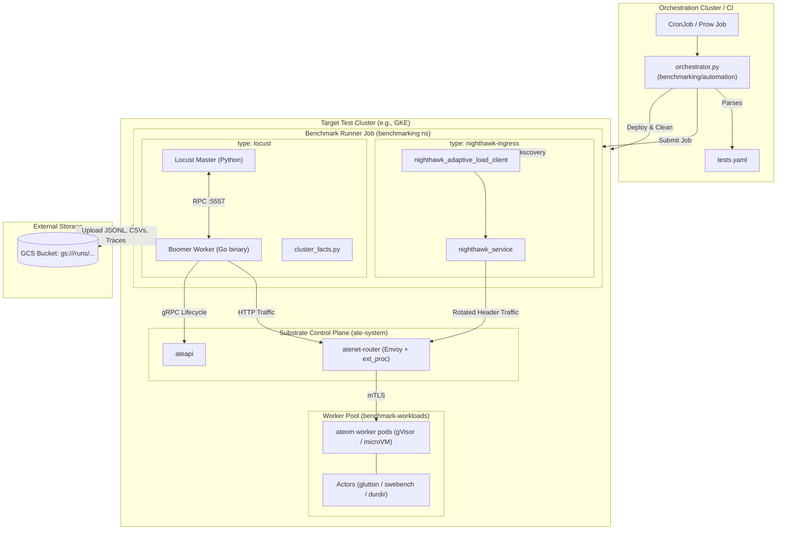

# Scale Testing in Agent Substrate

## Overview & Execution Context

Agent Substrate provides a dedicated benchmarking, load-generation, and telemetry measurement framework located in `benchmarking/`, `cmd/benchmarking/`, and `internal/benchmarking/`. 

The framework is decoupled from presubmit CI and runs across separate environments depending on the scale and virtualization requirements of the tests.

### Presubmit CI vs. Automated Benchmark Runs

- **Presubmit (GitHub Actions)**: Scale tests do not run in PR presubmit workflows (`.github/workflows/pr-workflow.yaml:28-223`). Presubmits run unit tests (`go test -race ./...`), root-gated tests (`hack/run-root-tests.sh`), apitool tests, static verification scripts (`hack/verify-all.sh`), and functional 1-node Kind E2E tests (`hack/run-e2e-kind.sh`). The only benchmark-related check in presubmit is `hack/verify/python-protos.sh:17-29`, which verifies that Python gRPC client stubs for benchmarks compile cleanly.
- **Scheduled & CI Benchmarks (Orchestrator / Prow)**: Scale tests run against dedicated Kubernetes clusters (e.g., GKE) using the benchmark orchestrator (`benchmarking/automation/orchestrator.py:1-100`). Tests are executed via Kubernetes CronJobs (`benchmarking/automation/manifests/cronjob.yaml.tmpl:1-60`) or Prow jobs. The orchestrator deploys Substrate, runs isolated test jobs, collects artifacts, tears down Substrate between runs, and uploads results to Google Cloud Storage (GCS).
- **Manual / Developer Runs**: Benchmarks can be triggered manually against dev clusters using `benchmarking/deploy_locust.sh:1-50` (fronted by the Locust Web UI on port 8089) or `benchmarking/nighthawk-ingress/run-dev.sh:1-50`.



---

## Test Engines & Suite Inventory

The benchmark framework defines two distinct test engines configured in `benchmarking/automation/tests.yaml`:

1. **Locust + Boomer Engine (`type: locust`)**: Uses a Python Locust master to manage run coordination and shapes, while a Go-based Boomer client (`cmd/benchmarking/boomer-worker/main.go`, `internal/benchmarking/boomer/`) generates high-throughput gRPC and HTTP load without Python concurrency bottlenecks.
2. **Nighthawk Ingress Engine (`type: nighthawk-ingress`)**: Uses Envoy’s Nighthawk distributed load generator (`benchmarking/nighthawk-ingress/`) in an open-loop adaptive search mode to benchmark `atenet-router` capacity.

### Defined Test Suites (`benchmarking/automation/tests.yaml`)

| Category | Suite Names | Engine / User Class | Workload & Runtime Profile | Scope & Purpose |
|---|---|---|---|---|
| **Baseline Concurrency** | `glutton_baseline_1_user`<br/>`glutton_baseline_1_user_pause`<br/>`glutton_baseline_5_users`<br/>`glutton_baseline_5_users_pause`<br/>`glutton_baseline_10_users`<br/>`glutton_baseline_10_users_pause` | Locust / Boomer (`GluttonUser`) | 1–10 VUs, 1–10 worker pods, 256Mi RAM (`gvisor`) | Rapid actor lifecycle (Resume → Ping → Suspend/Pause) under varying concurrency (`tests.yaml:86-120, 250-300`). |
| **Scheduler Oversubscription** | `glutton_oversubscribe_15_users` | Locust / Boomer (`GluttonUser`) | 15 VUs over 10 worker pods (50% oversubscribed) | Evaluates scheduler queueing, worker contention, and multiplexing capacity (`tests.yaml:301-315`). |
| **Large-Memory Working Sets** | `glutton_mem_1gi_gvisor`<br/>`glutton_mem_1gi_gvisor_pause`<br/>`glutton_mem_1gi_microvm`<br/>`glutton_mem_2gi_gvisor`<br/>`glutton_mem_2gi_gvisor_pause`<br/>`glutton_mem_2gi_microvm` | Locust / Boomer (`GluttonUser`) | 1 VU, 1 worker, 1536Mi / 2560Mi RAM (`gvisor` & `microvm`) | Fills 1–2 GiB resident RAM with incompressible random data; churns 64 MiB dirty memory per cycle; walks memory after resume to benchmark demand paging (`tests.yaml:121-250`). |
| **Observability Telemetry Ladder** | `observability_s0_idle_floor`<br/>`observability_s1_user_sweep`<br/>`observability_s2_sample_rate_sweep`<br/>`observability_s3_soak` | Locust / Boomer (`GluttonUser` + `ladder_shape.py`) | 0–15 VUs, 10 workers, 5–10m duration | Evaluates OTel collector intake, span/datapoint rates, collector memory slope, and dropped series under varying trace sample rates (0%, 10%, 100%) (`tests.yaml:317-375`, `benchmarking/observability.md:16-65`). |
| **Durable Directory (DurDir)** | `durdir_data_baseline`<br/>`durdir_data_pause`<br/>`durdir_full_baseline`<br/>`durdir_full_pause`<br/>`durdir_implicit_resume`<br/>`durdir_size_5mb`, `_10mb`, `_64mb`, `_64mb_pause` | Locust / Boomer (`DurdirUser`) | 1 VU, 1 worker, 5–64 MiB payload | Validates Durable Directory filesystem state restoration, SHA-256 byte verification, and snapshot size stability across overwrites (`tests.yaml:377-515`). |
| **SWE-Perf Trajectory** | `sweperf` (workload harness) | Locust / Boomer (`SweperfUser`) | 1+ VUs, `swebench-astropy-7336` template | Replays real SWE-bench agent trajectories across partitioned cycles, suspending and resuming between cycles (`internal/benchmarking/boomer/sweperf/sweperf.go`). |
| **Router Ingress Capacity** | `ingress_routercap_envoy_2cpu`<br/>`ingress_routercap_envoy_4cpu`<br/>`ingress_routercap_envoy_8cpu`<br/>`ingress_routercap_envoy_16cpu` | Nighthawk (`nighthawk-ingress`) | 50 warm actors, router pinned to 2–16 CPUs, 30m budget | Binary-searches max sustainable RPS through `atenet-router` (Envoy + ext_proc) under a 25ms tail-latency SLO (mean+2σ), 99.9% success rate, and 90% send rate (`tests.yaml:517-606`). |
| **Component Stubs** | `ate_api.py`, `counter_demo.py`, `sleep.py`, `usermem.py`, `kernelmem.py` | Locust (Python VUs) | Configurable | Lightweight harnesses for testing control plane gRPC CRUD, routed HTTP counters, memory stress, and basic sleep cycles (`benchmarking/locust/tests/`). |

---

## Data Captured by Scale Tests

Test executions generate structured artifacts uploaded to Google Cloud Storage under `gs://<dest>/runs/<test_name>/run_date=<YYYY-MM-DD>/run_ts=<epoch>/run_tag=<commit>/`:

1. **Locust & Boomer Metrics**:
   - `status.json`: Execution result (`locust_exit_code`, `stats_generated`) (`benchmarking/locust/runner.py:515-525`).
   - `stats.csv` & `stats_history.csv`: Request counts, failure counts, RPS, and latency percentiles (p50, p66, p75, p80, p90, p95, p98, p99, p99.9, p99.99, max, min, avg).
   - `stats.jsonl`: Formatted metric entries keyed by method (e.g. `grpc_CreateActor`, `grpc_ResumeActor`, `grpc_SuspendActor`, `http_DurDirServeAfterResume`).
   - `traces.txt`: Sampled OpenTelemetry spans containing `time`, `name`, `duration_ms`, `latency_source` (`client` vs `server`), `trace_id`, and `err` (`benchmarking/locust/runner.py:225-265`).

2. **Hardware Facts & Density Frontiers (`benchmarking/locust/cluster_facts.py:186-276`)**:
   Appended to `stats.jsonl` under the `trial_summary` metric record:
   - **Hardware Capacity**: `machine_type`, `node_count`, `allocatable_cores`, `allocatable_ram_gb`, `worker_pod_count`.
   - **Density Frontiers**:
     $$\text{actors\_per\_node} = \frac{\text{peak\_actors}}{\text{node\_count}}, \quad \text{actors\_per\_vcpu} = \frac{\text{peak\_actors}}{\text{allocatable\_cores}}, \quad \text{actors\_per\_gb\_ram} = \frac{\text{peak\_actors}}{\text{allocatable\_ram\_gb}}$$
   - **Pod Distribution**: `actors_per_pod_p50`, `actors_per_pod_p90`, `actors_per_pod_p99`.
   - **Failure Ratios**: `aggregate_failure_ratio` and per-operation failure ratios (e.g., `resume_actor_failure_ratio`).

3. **Nighthawk Ingress Output (`benchmarking/nighthawk-ingress/output.py`)**:
   - `capacity.json`: Final verdict containing `slo_max_rps`, `binding_threshold` (which SLO bounded the test), achieved RPS, and p50/p95/p99 latencies.
   - `stats.jsonl` & `results.json`: Stage-by-stage latency distributions and error counters.

4. **Telemetry Volume Metering (`benchmarking/telemetry/README.md`)**:
   - Scraped via Prometheus from `telemetry-meter` on port 8889 (`meter.yaml`):
     - `sum by (service_name) (rate(substrate_spans_total[5m]))`
     - `60 * sum by (service_name) (rate(substrate_datapoints_total[5m]))`
     - Collector intake & health: `otelcol_receiver_accepted_spans`, `otelcol_receiver_refused_spans`, and stream limits.

---

## SWE-Perf Real-World Trajectory Benchmarking

The SWE-Perf workload integration (`internal/benchmarking/boomer/sweperf/sweperf.go`, introduced in commit `cdac9bae`) replaces synthetic load with execution traces from real-world software engineering tasks.

### Upstream Project: `gke-labs/sweperf`

[gke-labs/sweperf](https://github.com/gke-labs/sweperf) emulates autonomous coding agents (e.g., SWE-agent, OpenHands) inside standalone Docker containers without invoking live LLM APIs:
- **Trace Replay Server (`replay.py`)**: A Python HTTP server running inside the container that loads recorded command trajectories (shell commands, git operations, file edits, pytest invocations).
  - `GET /status` or `/health`: Reports server readiness and current step progress.
  - `POST /execute` (or `/`): Accepts `{"start_step": int, "end_step": int}`, dispatches commands in a subshell, and returns a `job_id`.
  - `GET /status?job_id=<id>`: Polls asynchronous job status until completion.
- **Think-Time Simulation**: By default, `replay.py` simulates LLM latency via log-normal sleep delays ($ \mu \approx 15.6\text{s} $). Setting `SWEPERF_DISABLE_INTERNAL_SLEEP=1` bypasses internal sleep, allowing external harnesses to control the lifecycle.

### Substrate Integration & Execution Flow

Substrate uses SWE-Perf to evaluate sandbox suspension and resumption on realistic container states:

1. **Workload Definition (`benchmarking/workloads/manifests/swebench-astropy-7336-template.yaml.tmpl`)**:
   - Points to a task container image containing the `astropy-7336` benchmark environment.
   - Entrypoint: `python3 /opt/swebench/replay.py /opt/swebench/astropy_trace.json`.
   - Environment: `SWEPERF_DISABLE_INTERNAL_SLEEP=1`.
   - Snapshot scope: `onPause: SNAPSHOT_CONTENT_SCOPE_FULL`, `onCommit: SNAPSHOT_CONTENT_SCOPE_FULL` (persists process memory and filesystem changes to GCS).

2. **Step Chunking (`sweperf.go:88-111`)**:
   The trajectory (default 21 steps) is partitioned into contiguous cycles (default 4 cycles) via `generateDynamicChunks`:
   - Cycle 1: Steps 1–6 (code search and inspection)
   - Cycle 2: Steps 7–11 (source file modifications)
   - Cycle 3: Steps 12–16 (running regression test suites)
   - Cycle 4: Steps 17–21 (verification and git diffing)

3. **Cycle Lifecycle Execution (`sweperf.go:470-509`)**:
   For each cycle, the Go Boomer worker executes:
   - `ResumeActor` (RPC to `ateapi`): Wakes the container and restores memory from snapshot.
   - `POST /execute`: Dispatches the step slice to `replay.py` via `atenet-router` (using the `ate-target-actor` routing header).
   - `pollJobCompletion`: Polls `GET /status?job_id=` every 200 ms until steps finish. Measured and recorded as `Workload_Cycle_<N>`.
   - `SuspendActor` (RPC to `ateapi`): Checkpoints the live container state to GCS.
   - Inter-cycle wait: Jitters a think-time delay (`[MinWait, MaxWait)`), simulating agent reasoning while freeing compute capacity.
   - Loop reset: When all cycles finish, `resetCycles()` rewinds to Cycle 1 to sustain continuous load.

---

## Container Lifecycle: Freezing, Checkpointing, and Resuming

### Triggering: Automatic vs. Explicit

| Operation | Trigger Mechanism | Built into Substrate? | Description |
|---|---|---|---|
| **Resume** | Ingress traffic or Explicit RPC | **Yes (Traffic-Automatic or RPC)** | Incoming requests to `atenet-router` with an `ate-target-actor` header automatically invoke `ResumeActor` via Envoy's `ext_proc` filter (`cmd/atenet/internal/router/ingress/ingress.go:101-160`). The client HTTP request is parked in an in-memory queue (`parking.go`) until the sandbox is restored and passes its readiness probe. Alternatively, clients can invoke the `ResumeActor` gRPC method directly. |
| **Suspend** | Explicit RPC or Node Eviction | **Explicit (API-driven)** | Substrate **does not** feature an autonomous background idle daemon that silently freezes actors without instruction. Suspension must be explicitly requested via `SuspendActor` (or `PauseActor`). During worker pod evictions or node drains, Substrate also initiates suspension to avoid data loss (`docs/api-guide.md:455-460`). |

### Under the Hood Implementation

```mermaid
sequenceDiagram
    autonumber
    participant AteAPI as ateapi (Control Plane)
    participant Atelet as atelet (Node Daemon)
    participant Ateom as ateom Worker Pod
    participant Storage as GCS / Object Storage

    Note over AteAPI,Storage: Checkpoint / Suspend Flow
    AteAPI->>Atelet: Checkpoint(req)
    Atelet->>Ateom: CheckpointWorkload(req)
    Note over Ateom: runsc checkpoint (gVisor)<br/>or VMM dump (microVM)
    Ateom->>Ateom: Serialize memory & open sockets
    Ateom->>Ateom: tarutil: Archive overlay upper & durable dirs
    Ateom-->>Atelet: Checkpoint files written to node disk
    Atelet->>Storage: uploadExternalCheckpoint (memory + tarballs + manifest)
    Atelet-->>AteAPI: Snapshot URI confirmed
    AteAPI->>AteAPI: State -> SUSPENDED; unbind worker pod

    Note over AteAPI,Storage: Restore / Resume Flow
    AteAPI->>AteAPI: Bind free worker pod in WorkerPool
    AteAPI->>Atelet: Restore(workerPod, snapshotUri)
    Atelet->>Storage: downloadExternalCheckpoint (pulls snapshot)
    Atelet->>Ateom: RestoreWorkload(req)
    Note over Ateom: runsc restore -background -detach
    Ateom->>Ateom: Demand-page RAM on fault & restore FS
    Atelet->>Ateom: One-shot HTTP wakeupProbe (:80 /status or /readyz)
    Ateom-->>Atelet: 200 OK
    Atelet-->>AteAPI: Restore success
    AteAPI->>AteAPI: State -> RUNNING
```

1. **Freezing the Sandbox**:
   - `ateapi` forwards `SuspendActor` to `atelet` (`cmd/atelet/main.go:592`), which calls `ateom` on the worker pod.
   - For **gVisor (`runsc`)**: Executes `runsc checkpoint -image-path ...` (`cmd/ateom-gvisor/runsc.go:149-170`). The sentry pauses vCPUs and dumps memory pages, process trees, and open socket states to `CheckpointStateDir` (`internal/ateompath/ateompath.go:77-85`).
   - For **microVM**: The VMM pauses execution and dumps `guest.ram` and device state.
   - Filesystem deltas (overlay upper directories and durable directories) are archived using `internal/tarutil/tarutil.go`.
2. **Uploading to GCS**:
   - `atelet` executes `uploadExternalCheckpoint` (`cmd/atelet/main.go:787-835`), streaming memory files, disk tarballs, and `sandbox-assets.json` to `gs://${BUCKET_NAME}/...`.
   - On completion, `atelet` cleans node scratch files, updates `status.externalSnapshot`, marks the actor `ACTOR_STATE_SUSPENDED`, and releases the worker pod back to the pool.
3. **Restoring the Sandbox**:
   - `ResumeActor` assigns an available worker pod and triggers `atelet.Restore` (`cmd/atelet/main.go:963`).
   - `atelet` downloads the snapshot bundle from GCS (`downloadExternalCheckpoint`, line 1396).
   - For gVisor: Calls `runsc restore -bundle ... -image-path ... -background -detach` (`cmd/ateom-gvisor/runsc.go:270-305`). With `-background -direct`, `runsc` resumes execution immediately and **demand-pages memory chunks on fault**, minimizing resume latency.
   - For microVM: Restores `guest.ram` and re-attaches VirtIO devices.
   - Substrate verifies readiness using a single-shot HTTP `wakeupProbe` (or `/readyz`, `docs/api-guide.md:305-325`).

---

## Empirical Benchmark Measurements

Raw run outputs are published directly to GCS and are not checked into git (`benchmarking/observability.md:10-15`, `benchmarking/README.md:122-125`). However, verified benchmark runs recorded in recent commits establish current baseline metrics:

### 1. ResumeActor & Pause Optimization (Commit `d3aec58c`, Sep 25, 2026)
*Setup: 17 worker pods, 15 actors, `glutton` workload (512 MiB RAM, 32 MiB churn/cycle), 120s duration, 100% pause mode on GKE:*

| Metric | Upstream Main Baseline | With `os.Link` Local Checkpoint | With Ephemeral `fsync` Removal | Improvement |
|---|---|---|---|---|
| **Completed Cycles (120s)** | 106.5 cycles | 160.0 cycles | **212.5 cycles** | **2.00x throughput** |
| **Cycle Throughput** | 53.3 cycles/min (0.89/s) | 80.0 cycles/min (1.33/s) | **106.3 cycles/min (1.77/s)** | **+99.4%** |
| **`ResumeActor` Latency (p50)** | 6,000 ms | 4,100 ms | **210 ms** | **28.6x faster** |
| **`ResumeActor` Latency (avg)** | 7,023 ms | 4,867 ms | **246 ms** | **28.5x faster** |
| **`ResumeActor` Latency (p90 / p99)** | 15,000 ms / 19,000 ms | 9,400 ms / 20,000 ms | **350 ms / 590 ms** | **32x faster tail** |

### 2. Nighthawk Ingress Dataplane Capacity (Commit `3eaf6c2f`)
*Setup: `atenet-router` pinned to 2 CPUs, 50 warm actors receiving rotated traffic, 25ms tail-latency SLO (mean+2σ):*
- **Sustained Capacity**: **~8.9k RPS** meeting all SLOs.

### 3. SWE-Perf Real-World Trajectory Benchmark (Commit `cdac9bae`, Sep 22, 2026)
*Setup: 1 VU, `swebench-astropy-7336` template, 21 trace steps across 4 cycles on GKE (`gvisor`):*

| Operation | Total Requests | Failures | Average Latency (`AVG_ms`) |
|---|---|---|---|
| `CreateActor` | 1 | 0 | 1 ms |
| `CreateAtespace` | 1 | 0 | 1 ms |
| `ResumeActor` | 20 | 0 | **495 ms** |
| `SuspendActor` | 20 | 0 | **947 ms** |
| `Workload_Cycle_1` | 5 | 0 | 1,996 ms |
| `Workload_Cycle_2` | 5 | 0 | 964 ms |
| `Workload_Cycle_3` | 5 | 0 | 4,877 ms |
| `Workload_Cycle_4` | 5 | 0 | 3,022 ms |
*Result: 164 total requests, 0 failures, 0.0% error ratio.*

### 4. Hardware Facts & Density Frontier Verification (Commit `3198991d`, Sep 24, 2026)
*Setup: Verification of `cluster_facts.py` discovery against live GKE cluster:*
- **Discovered Hardware**: Machine type `c3d-standard-8`, 1 node, 7.91 allocatable CPU cores, 27.73 GiB allocatable RAM.
- **Worker Density**: 5 worker pods (`benchmark-ateom`).

### 5. Durable Directory (DurDir) Persistence & Scale (Commit `ba45517f`)
- **Data Integrity**: Verified up to **1 GiB** payload persistence with 0 failures and 0 SHA-256 digest mismatches across container cold boots.
- **Baseline Ping**: `glutton_baseline_5_users` confirmed 919 requests with 0 failures and a **7 ms** ping latency.

---

## Open & Unresolved Items

1. **Public Artifact Registry for SWE-bench Images**: The `swebench-astropy-7336` template currently relies on private Artifact Registry paths (`swebench-astropy-7336-template.yaml.tmpl:27-29`). A shared public registry for pre-baked SWE-bench task images remains planned.
2. **Automated Idle Suspension**: While resumption is traffic-automatic via request parking, automatic idle-timeout suspension is not implemented in the core control plane. External agents or orchestrators must explicitly call `SuspendActor`.
3. **Telemetry Volume Artifact Export**: As noted in `benchmarking/observability.md:68-80`, `runner.py` captures Locust statistics, but exporting per-service OpenTelemetry volumes directly into test run artifacts (rather than requiring separate Prometheus queries) remains an open work item.
4. **Historical Trendlines**: Historical performance metrics reside in external GCS buckets and BigQuery datasets and cannot be queried offline from the repository checkout alone.
